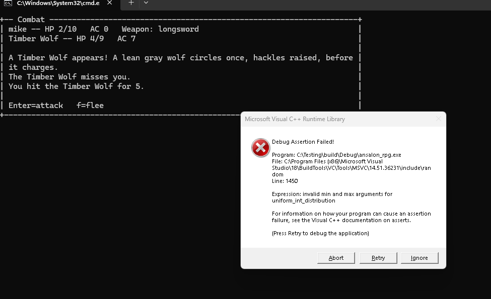

# Combat notes

## Accuracy: what's sourced, what's invented

The core resolution math is transcribed from a scanned copy of the 2e
Player's Handbook (revised), visually confirmed against rendered page
images (same discipline as every other rules pass in this project):

- **Table 1 (Strength, PHB p.19)**: to-hit and damage adjustments per STR
  score, including the 18/01–18/00 exceptional-strength sub-brackets.
  `docs/CHARACTER_NOTES.md` flagged this as deliberately skipped "until
  combat exists to use them" since Milestone 4 — it does now, so it's
  implemented, not deferred again. See `character::strengthToHitAdjustment`/
  `strengthDamageAdjustment` (`character/Ability.h/.cpp`).
- **Attack roll** (PHB p.119, p.121): 1d20 + STR to-hit adjustment; hit if
  the total ≥ (attacker's THAC0 − target's AC). A natural 20 always hits
  and a natural 1 always misses, checked against the *unmodified* die
  ("regardless of any modifiers applied to the die roll" — the book's own
  wording).
- **Initiative** (PHB p.124): one d10 per side per round, lower roll acts
  first. Ties are re-rolled rather than resolved "simultaneously" as the
  book describes — this project's round loop is strictly ordered (one
  side acts, then the other, with the second side skipped if the first
  already ended the fight), which has no way to represent two things
  happening at once. See `combat::playerActsFirst`. A warrior's side of
  that exchange can now be more than one swing (see Table 15 below) —
  those all resolve together within that side's own turn, still ordered
  strictly against the monster's single action.
- **Attacks per round** (PHB Table 15, p.36, "Warrior Melee Attacks per
  Round"): Fighter (this project's only implemented Warrior-group class —
  Paladin/Ranger don't exist here) gets 1/round at levels 1–6, 3/2 rounds
  at 7–12, 2/round at 13+; every other class stays at 1/round, per the
  book's own text scoping multiple attacks to "warriors." Modeled as of
  Milestone 108 via `character::meleeAttacksThisRound`, consumed by
  `GameLoop::runCombat`'s `playerAttacks` lambda — see
  `docs/CHARACTER_NOTES.md`'s "Leveling / experience" section. The "3/2
  rounds" rate's odd/even split (1 attack on odd rounds of the fight, 2 on
  even) is this project's interpretation, not printed verbatim — the book
  states the rate but not which rounds carry the extra swing.

**Not specifically re-verified this pass, called out honestly rather than
overclaimed**: damage is floored at 1 on a hit
(`combat::resolvePlayerAttack`/`resolveMonsterAttack`). This is a
near-universal D&D convention across editions, but this project didn't
pull up the exact PHB page stating it for 2e specifically — if a future
pass finds a different rule, this is a one-line fix.

**Monster stats are now sourced.** `Monster Manual (2nd ed).pdf` (actually
the 1993 *Monstrous Manual* compilation, confirmed via its own title page)
was added to the project's local reference library specifically for this,
and `data/monsters.txt` was rebuilt from it — visually confirmed against
rendered page images, same discipline as everything else. This project
models Krynn specifically, which has **no orcs** (a deliberate,
long-standing Dragonlance lore point, not an oversight) — the roster below
was chosen and checked with that constraint in mind.

- **Goblin** (p.163): HD 1-1, AC 6, THAC0 20, 1d6 damage.
- **Kobold** (p.214): HD 1/2 (1-4 hp), AC 7, THAC0 20, 1d4 damage.
- **Hobgoblin** (p.191): HD 1+1, AC 5, THAC0 19. Damage is "by weapon" in
  the book (no fixed die); 1d8 was picked as a reasonable stand-in given
  their typical loadout (polearm/morningstar/sword).
- **Timber Wolf** ("Wolf," p.362): HD 3, AC 7, THAC0 18, damage 2-5 (1d4+1).
- **Giant Spider** (p.326): HD 3+3, AC 4, THAC0 17, bite 1d8, **Type F
  poison** — "causes immediate death if the victim fails the saving
  throw," no save-roll modifier printed for the standard Giant Spider
  (visually confirmed, page text search). Now modeled — see "Saving
  throws in combat" below for the mechanic and how literal "death" is
  reconciled with this project's no-permadeath rule.
- **Baaz Draconian** (*Dragonlance Adventures*, TSR 2021, p.75 — the
  Monstrous Manual has no draconians, they're Dragonlance-specific): HD 2,
  AC 4, 20% magic resistance (not modeled, same reasoning as the spider's
  poison), two claws (1d4/1d4) or one weapon attack — simplified to a
  single 1d8 weapon hit, since this project doesn't model multiple attacks
  per round for anyone. **THAC0 isn't printed in the Dragonlance book at
  all** (it only gives HD) — derived as 19 from the Monstrous Manual's own
  HD-to-THAC0 pattern (empirically consistent across every entry checked;
  the book bakes the conversion into each stat block rather than printing
  one shared table). Its "turns to stone on death" trait — the single most
  iconic thing about Baaz Draconians — gets a special victory message in
  `GameLoop::runCombat` rather than being just flavor text.
- **Bugbear** (p.32): HD 3+1, AC 5, THAC0 17, damage 2d4 (2-8). The book's
  "+3 to all melee damage" (giant Strength bonus) and "or by weapon"
  branch aren't modeled — same monster-side-weapon-bonus simplification
  already applied to Hobgoblin/Baaz.
- **Ogre** (p.272): HD 4+1, AC 5, THAC0 17, damage "1-10 or by weapon +6"
  in the book — simplified to a flat 1d10, same reasoning as Bugbear
  above.
- **Kapak Draconian** (*Dragonlance Adventures*, TSR 2021, p.74-75 — like
  the Baaz, not in the Monstrous Manual): HD 3, AC 4, damage 1d4. **THAC0
  isn't printed** (same gap as the Baaz) — derived as 18 from the same
  HD-to-THAC0 pattern, confirmed against the Timber Wolf's real printed
  HD 3 → THAC0 18. The Kapak's real venomous bite causes **paralysis**
  (2d6 turns on a failed save vs. poison) — a mechanically different
  effect from the Giant Spider's Type F death-poison this project's
  `poisonOnHit` flag models, so reusing that flag would misrepresent it.
  Left unmodeled (flavor-only), same restraint as the Baaz's unmodeled
  20% magic resistance. Its acid-pool-on-death trait is also not modeled
  (no environmental-hazard system for anyone yet).
- **Gnoll** (p.158): HD 2, AC 5, THAC0 19, damage 2-8 (2d4) — "by weapon"
  in the book, same monster-side-weapon simplification as Hobgoblin/
  Bugbear/Ogre. XP 35.
- **Ghoul** (p.131): HD 2, AC 6, THAC0 19, XP 175. Real attack is three
  hits (claw/claw/bite, 1-3/1-3/1-4-or-6 — the last die was genuinely
  ambiguous across both extractions of the scan, reading as either 1-4
  or 1-6 depending on which of the page's parallel monster columns is
  checked) — simplified to a single 1d6 hit, same "one representative
  die" treatment as Baaz's two claws. Real Ghouls also paralyze on a hit
  (save vs. paralyzation or be unable to act) — left unmodeled, same
  restraint as the Kapak's paralysis-poison bite above (no status-effect
  system exists for anyone yet).
- **Skeleton** (p.315, the base "Skeleton" column on that page — not the
  Animal or Monster skeleton variants sharing it): HD 1, AC 7, THAC0 19,
  damage 1-6 (weapon), XP 65. Real Skeletons take half damage from
  edged/piercing weapons and are immune to sleep/charm/hold/cold/fear —
  no per-monster damage-type or immunity mechanic exists in this project
  (same restraint as Baaz's unmodeled magic resistance), so it's flavor
  text in `DESC` only.
- **Zombie** (p.373, the base "Common" column — not the Monster/Ju-ju/
  Lord/Sea variants sharing it): HD 2, AC 8, THAC0 19, damage 1-8, XP 65.
  Real Zombies are immune to sleep/charm/hold/death-magic/poison/cold,
  same flavor-only treatment as the Skeleton's immunities above.
- **Bozak Draconian** (*Dragonlance Adventures*, TSR 2021, p.74): HD 4,
  AC 2, two claws (1d4/1d4) or by weapon — simplified to a single 1d8
  weapon hit, identical wording and treatment to the Baaz's own stat line.
  **THAC0 isn't printed** (same gap as Baaz/Kapak) — derived as 17 from
  this project's established HD-to-THAC0 pattern, the same bracket as
  Ogre's real printed HD 4+1 → THAC0 17. Real spellcasting (as a
  4th-level magic-user: burning hands, enlarge, magic missile, shocking
  grasp, invisibility, levitate, stinking cloud, web) — Milestone 99 models
  the signature spell, Magic Missile, as a real special attack: 40% chance
  per round (invented pacing, the book gives no frequency) to cast it
  instead of its weapon attack, dealing the same PHB p.176 math as the
  player's own `magic_missile` spell (`character::castSpell`) fixed at
  "4th-level caster" — 1d4+1 per missile, 2 missiles, no attack roll, no
  saving throw (`combat::Monster::castsMagicMissile`/
  `magicMissileChancePercent`, applied in `game::GameLoop::runCombat`'s
  `monsterAttacks` lambda before the normal `resolveMonsterAttack` call).
  The other seven favored spells, +2 saves, and 20% magic resistance stay
  unmodeled, same restraint as Baaz's own unmodeled magic resistance. Its
  bone-explosion death trait is likewise unmodeled, same treatment as
  Kapak's acid pool.
- **Sivak Draconian** (*Dragonlance Adventures*, TSR 2021, p.75): HD 6,
  AC 1, two swords (1d6/1d6) plus an armored tail (2d6) — simplified to a
  single 2d6 hit (its highest, most distinctive die), same "one
  representative die" treatment as the Ghoul's claw/claw/bite. **THAC0
  isn't printed** — derived as 15, one HD-to-THAC0 bracket further down
  from the Bozak above. Real shapeshifting (takes the form of a humanoid it
  kills, or its own killer's form on death) stays unmodeled — no persistent
  per-monster identity or NPC-disguise gameplay exists to hang it on (this
  project's `combat::Monster` is static content shared by every encounter
  with that species, not a per-instance actor), same restraint as ever.
  +2 saves and 20% magic resistance are unmodeled too. Its death-burst
  ("killed by something larger than itself... burst into flames... 2d4
  points of damage... no saving throw") is real as of Milestone 99, though
  simplified: this project has no SIZE stat to check the book's "larger
  than itself" condition against, so it always fires
  (`combat::Monster::burstsIntoFlameOnDeath`, applied in
  `game::GameLoop::runCombat`'s post-victory block right after XP/steel are
  awarded) — a genuine retaliatory hit, unlike Baaz's stone/Kapak's
  acid/Bozak's bone-explosion, which all stay flavor-only victory
  messages. Can knock the player out even after they already landed the
  killing blow — see "Death: knocked out, not killed" below for how
  that's handled.
- **Aurak Draconian** (*Dragonlance Adventures*, TSR 2021, p.73): HD 8,
  AC 0, twin energy blasts (1d8+2 each) or a spell — simplified to a
  single 1d8+2 hit. **THAC0 isn't printed** — derived as 13, the same
  pattern extended to the highest HD this project has extrapolated it to
  (see the caveat below). The most mechanically loaded monster in the
  roster: limited dimension door, suggestion/mind control, change self,
  polymorph self, at-will invisibility, and real 1st- to 4th-level
  magic-user spellcasting all stay unmodeled — none of them translate
  cleanly into this project's positionless, no-disguise-gameplay 1-vs-1
  combat loop, same restraint applied to Sivak's shapeshifting above. Its
  real three-stage death (immolation → lightning ball → explosion), 30%
  magic resistance, and +4 saves are likewise unmodeled. Its noxious-cloud
  breath weapon is real as of Milestone 99: 30% chance per round (invented
  pacing — the book's real "three times per day" has no way to track
  across stateless encounters with no monster-instance persistence, so
  it's compressed to "available this whole fight," gated only by the
  per-round roll) to breathe instead of its weapon attack, rolling
  `combat::rollSavingThrow` against the (previously dormant in live combat)
  `character::SaveCategory::BreathWeapon` — save for half of the book's 20
  damage, or full damage plus blinded (a -4 this-fight to-hit penalty,
  applied the same way as Frostreaver's/spell buffs' this-fight-only
  bonuses; the book names the condition but not a number, so this value is
  invented) (`combat::Monster::hasBreathWeapon`/
  `breathWeaponChancePercent`, same lambda as Bozak's Magic Missile above).
- **Thanoi** (*Dragonlance Adventures*, TSR 2021, p.78, "Thanoi (Walrus
  Men)"): HD 4, AC 4, damage by weapon or tusk (1d8), plus a separately
  printed "any weapon used by a thanoi does 2 more points of damage than
  usual" — both numbers directly sourced, combined as 1d8+2. THAC0 derived
  as 17, the same HD-4 bracket as the Bozak above. XP 85 + 4/hp. The
  walrus-men of Icewall Glacier — already referenced as flavor-only
  dialogue at Ice Wall since Milestone 36, now a real roster entry.
  Originally shipped (Milestone 64) with `TERRAIN_BIAS` toward glacier
  (`:`, 3x weight there but still eligible everywhere else); tightened at
  Milestone 83, at the user's explicit request, to a hard `ONLY_TERRAIN :`
  lock, since a walrus-man turning up in ordinary grassland read wrong.
  **This is an invented gameplay restriction, not a sourced one** — unlike
  Gnoll's real Monstrous Manual Climate/Terrain field, *Dragonlance
  Adventures* prints no Climate/Terrain field for the Thanoi at all, so
  there's no book text to hang a hard restriction on; it's honestly the
  user's own call, not a transcription. Real cold immunity (natural and
  magical), extra fire/heat damage, and HD loss in warm climates are all
  unmodeled — no damage-type or elemental-exposure system exists for
  anyone yet, same flavor-only restraint as Skeleton's/Zombie's immunities.
- **Owlbear** (Milestone 100, p.284): HD 5+2, AC 5, THAC0 15, XP 420. Real
  attack is three hits (claw/claw/beak, 1d6/1d6/2d6) — simplified to a
  single 2d6 hit (the beak, its most distinctive and damaging attack), same
  "one representative die" treatment as the Ghoul's/Sivak's own multi-attack
  simplifications above. Its real "hug" special attack (an 18+ claw hit
  drags the victim in for 2d8 ongoing squeeze damage per round) is left
  unmodeled — no grapple/ongoing-effect state exists for anyone yet.
- **Wight** (Milestone 100, p.360): HD 4+3, AC 5, THAC0 15, damage 1d4, XP a
  flat 1,400 (its outsized level-drain value, not a per-hp formula). Real
  Special Attacks (a level-draining touch) and Special Defenses (hit only by
  silver or +1-or-better magical weapons) are both left unmodeled — no
  level-drain or weapon-enchantment-gate mechanic exists for anyone yet,
  same restraint as the Ghoul's paralyzing touch and the Draconians'
  unmodeled magic resistance.
- **Troll** (Milestone 100, p.349, the base "Troll" column only — not the
  Two-headed/Freshwater/Saltwater/Desert/Spectral/Giant/Ice variants sharing
  the same page): HD 6+6, AC 4, THAC0 13, XP a flat 1,400 (same as Wight, no
  formula to simplify). Real attack is three hits (claw/claw/bite,
  1d4+4/1d4+4/1d8+4) — simplified to a single 1d8+4 hit (the bite), same
  treatment as the Owlbear's beak above. Real Special Defenses
  (regeneration — 3 hp/round starting three rounds after first blood,
  stopped only by fire or acid) is left unmodeled — no per-round monster HP
  recovery exists in `runCombat`.
- **Black Bear** (Milestone 107, p.17, the "Bear" comparison table): HD 3+3,
  AC 7, THAC0 17, XP 175 (all real, printed). Real attack is three hits
  (claw/claw/bite, 1-3/1-3/1-6) — simplified to a single 1d6 hit (the bite,
  its most damaging attack), same "one representative die" treatment as the
  Ghoul's/Owlbear's/Troll's own multi-attack simplifications. Treasure: Nil
  (printed) — no steel reward, same as the Wolf. Real Climate/Terrain is the
  broad "Temperate land" — weighted toward forest/hills as an invented
  flavor bias, same "informed by, not transcribed from" treatment as the
  Bugbear's/Owlbear's own bias lines.
- **Worg** (Milestone 107, p.362, the "Wolf" comparison table): HD 3+3,
  AC 6, THAC0 17, damage 2d4 (2-8), XP 120 (all real, printed). Real
  Climate/Terrain is "Any forest" — an offshoot of dire wolf stock that
  "often serve as mounts of goblins," a direct thematic tie to the
  Goblin/Hobgoblin already in this roster. Treasure: Nil (printed) — no
  steel reward, same as the Wolf.
- **Ice Bear** (Milestone 107, *Dragonlance Adventures*, TSR 2021, p.76,
  the "Creatures of Krynn" chapter — same Krynn-specific source as the
  Draconians and Thanoi): HD 6+2, AC 6, XP a per-hp formula ("475 + 8/hp",
  real, printed) simplified to a flat 707 (475 + 8×29, using the average
  roll of 6d8+2), same treatment as the Draconians' XP. Real attack is
  three hits (claw/claw/bite, 1d8/1d8/2d8) — simplified to a single 2d8 hit
  (the bite), same treatment as the Black Bear above; its real "hugs for
  2d6 if both claws hit" is left unmodeled, same restraint as the Owlbear's
  own hug. Immune to cold is real but left flavor-only, same restraint as
  the Thanoi's own cold immunity. **THAC0 isn't printed** (same gap as
  every other DLA-sourced monster) — derived as 14 from this project's
  established HD-to-THAC0 pattern: Owlbear's real HD5+2 → THAC0 15 sits one
  bracket below plain HD6's own real value (Sivak, HD6 → THAC0 15), so a
  "+2" bonus behaves like roughly one extra full Hit Die in this
  progression — applying that same step to HD6+2 lands one bracket below
  Sivak's HD6, at 14. **No Climate/Terrain field is printed** (same gap as
  the Thanoi) — `ONLY_TERRAIN` glacier is an invented restriction, not a
  sourced field, justified by the prose ("track prey over snow and ice...
  the thanoi use them for this purpose, sharing the reward") — the same
  restriction the Thanoi already carries, and a direct in-book lore tie
  between the two.

**Sourcing caveat (Milestone 64)**: none of the four draconian/Thanoi
entries above print THAC0 (Dragonlance Adventures' stat-block format never
does), so all four are derived via the same "roughly one point of THAC0
per Hit Die" empirical pattern already used and validated for Baaz/Kapak.
That pattern was previously validated only up to HD 4+1 (Ogre's real
printed THAC0 17); Sivak (HD 6 → 15) and Aurak (HD 8 → 13) extend it past
that ceiling. All four new monsters have plain, non-bonus Hit Dice, so
each lands cleanly on a bracket boundary rather than a "+" tier, which is
the least ambiguous case for this kind of extrapolation — but it's still
an extrapolation, not a directly re-confirmed value, and is flagged as
such here.

**Sourcing caveat for this batch (Milestone 34)**: no PDF-page-image
renderer was available in that session (no `pdftoppm`/ImageMagick/Python
on the machine), so these four weren't visually confirmed against a
rendered page image the way every earlier monster was. Instead, each
stat block was extracted as text twice, independently
(`pdftotext -table` and `pdftotext -raw`, two different column-alignment
heuristics against the same scanned PDF), and only values both
extractions agreed on were used — cross-checked further against this
project's own established HD-to-THAC0 pattern (roughly one point of
THAC0 per Hit Die, the same empirical relationship already used to
derive the Baaz's and Kapak's un-printed THAC0 above; all four new
monsters' printed THAC0 fits comfortably). Still real text from the
actual scanned book, not memory — just missing the usual
visual-confirmation step. Worth re-confirming against a rendered page
image if that tooling becomes available later.

**Citation correction (Milestone 57)**: while re-sourcing terrain data for
this roster (see "Terrain-specific monster pools" below), 9 of the 11 page
numbers above turned out to be off by exactly +3 — they cited the PDF
viewer's own internal page count rather than the book's printed folio
(visible at the bottom of each page). Re-confirmed against rendered page
images showing the actual printed footer number and corrected in place
above; Bugbear's and Ogre's citations were already correct.

None of these have HP dice matching their HD 1:1 in a way this project can
represent with a plain `NdM+flat` -- 2e's default monster Hit Die is d8,
which is what `data/monsters.txt` uses throughout (e.g. HD 1-1 → `1d8-1`,
HD 3+3 → `3d8+3`).

## Weapon damage and Armor Class: real equipment now, not just a placeholder

Each class still starts with the same fixed weapon as before (Fighter
longsword 1d8, Cleric mace 1d6, Thief shortsword 1d6, Mage dagger 1d4,
Tinker "a well-worn wrench" 1d4, all in `character::ClassInfo`) — but as
of the equipment system (`docs/CHARACTER_NOTES.md`'s "Equipment"
section), that's now only the *starting* weapon, seeded onto
`Character::weaponName`/`weaponDamageSides` at creation. Buying a weapon
upgrade or armor at Solace's General Store (`character::Equipment`)
changes the character's own fields, and `combat::resolvePlayerAttack`
reads `character.weaponDamageSides`/`weaponDamageBonus` directly —
`ClassInfo`'s weapon fields are never consulted mid-game, only at
creation. `Character::armorClass` is likewise no longer always
`10 - Dex adjustment`: `Equipment::recomputeArmorClass` factors in
whatever armor/shield is equipped, called both at creation (a no-op
change when nothing's equipped yet) and after every purchase.

## Saving throws in combat

`combat::rollSavingThrow(character, category)` (`Combat.h/.cpp`) is a
thin, reusable wrapper: one d20 roll, succeeds if it's >= the character's
saving throw number for that category — same "at or above" convention
`character::SavingThrows` already documents. It's general (any future
monster/effect can call it against any of the five save categories), but
only one thing calls it today:

**The Giant Spider's poison bite.** `combat::Monster` gained a single
`bool poisonOnHit` flag (not a general Type A–N poison-type system — this
project only has one poison-bearing creature, so a flag is honest scope
rather than building unused generality), set via a new `POISON` line in
`data/monsters.txt`'s `MONSTER` block grammar. In
`GameLoop::runCombat`'s `monsterAttacks` lambda, a hit from a
`poisonOnHit` monster additionally rolls
`rollSavingThrow(character, SaveCategory::ParalyzationPoisonDeath)` on
top of the physical bite damage already applied: success just logs
"You resist the poison" (matching the book — even a successful save
against Type F poison has no lingering effect beyond the bite itself);
failure logs "The poison overwhelms you!" and sets `currentHp` to 0.

**Reconciling the book's "instant death" with this project's own rule**:
Type F poison's real effect on a failed save is literal death, but this
project made an explicit, user-confirmed decision (Milestone 9) to never
permadeath the player regardless of how they reach 0 HP. Setting
`currentHp = 0` inside `monsterAttacks` deliberately reuses the *existing*
post-round `if (state_.character.currentHp <= 0)` block — the same
knockout-and-return-to-Solace code path a normal lethal hit already
takes — rather than adding a second, separate "you died" branch. A failed
poison save is exactly as survivable as any other 0-HP moment, no worse.

**Not covered by this pass**: the Baaz Draconian's 20% magic resistance
is a different mechanic entirely (a resistance-to-being-targeted roll,
not a saving throw) and is still not modeled — see "Extending this
later" below.

## Combat is not a `GameState.mode`, and isn't saved

Unlike `Mode::Overworld`/`Mode::Zone`, an encounter is a **nested loop**
inside `game::GameLoop` (`runCombat`), not a third `Mode` value. It takes
over rendering/input in its own `for(;;)` loop — same shape as
`showCharacterSheet`'s existing one-keypress block, just longer-lived —
until the fight resolves, then returns control to the ordinary loop.

This means combat state (the monster's current HP, the log) is **not**
part of `GameState` and is never written to `save.txt`. A crash or
force-close mid-fight simply loses that encounter — the player resumes on
the overworld tile where it started, monster forgotten. This is a
deliberate trade-off: modeling combat as its own `Mode` and threading it
through `SaveGame` would have meant serializing monster identity + current
HP + a log, for a feature whose whole failure mode (the user's own choice
— see below) is already low-stakes.

## Death: knocked out, not killed

**User decision**, explicitly chosen over permadeath (which would have
fit the Caves-of-Qud inspiration this project was originally built
around): when the player's HP reaches 0, it's set to `maxHp` (a full heal,
not just enough to stand) and they wake up at the **nearest refuge**
(`GameLoop::nearestRefuge()`, straight-line tile distance from
`world::Location::isTown`/`seaLocked` entries -- see below) rather than
the run ending. There's no "you have died" screen, no save deletion,
nothing punitive beyond the trip back to safety.

**Which locations count as a "refuge"**: `world::Location` has a `bool
isTown` flag, set via an optional `TOWN` line in a `data/locations.txt`
block (see `docs/MAP_NOTES.md`). Five locations carry it -- Solace,
Haven, Kalaman, Tarsis, Palanthas -- the ones already tagged with a
civilian-settlement `TERRAIN` (forest-town/plains-town/coastal-town/dry-
plains-city/walled-port-city). Fortresses (Pax Tharkas, High Clerist's
Tower), ruins (Xak Tsaroth, Ice Wall), the nomadic Plains of Dust
village, and the elven homelands (Qualinesti/Silvanesti -- Silvanesti is
sealed to outsiders, a deliberate lore exclusion, not an oversight) are
not towns for this purpose.

**`seaLocked` (Milestone 90)**: a second, independent flag, also set via
an optional argument-less `data/locations.txt` line (`SEA_LOCKED`),
carried only by Ice Wall Castle. Added to close a real softlock the user
hit: the `frostreaver_salvage` quest requires killing Thanoi, which are
hard-locked to the glacier terrain immediately around Ice Wall Castle
(Milestone 83), and the *only* way to reach Ice Wall Castle at all is
Tarsis's Knight's Runner one-time `BOAT` voyage (Milestone 88, kept
deliberately one-time -- see "Sea travel" in `docs/ARCHITECTURE.md`). A
knockout on that glacier previously sent the player to the nearest actual
`isTown` location (Tarsis, ~56 tiles away), stranding them for good --
the boat back doesn't fire twice. `seaLocked` locations aren't civilian
settlements, but they're still a valid, safe place to wake up -- treating
them as "not a refuge" is exactly the bug. `nearestRefuge()` picks
whichever `isTown`- or `seaLocked`-flagged location is closest by
straight-line tile distance to where the player fell -- no pathfinding
system exists in this project, same restraint already applied to
`minutesToCross` being flat-per-tile -- falling back to Solace only if
nothing is found at all (defensive; can't happen with the current data).

**Two call sites (Milestone 99)**: the Sivak Draconian's real death-burst
(see the Draconian roster above) can finish the player off *after* they
already landed the killing blow -- an ordinary monster attack dropping the
player to 0 is no longer the only way into this ending. `GameLoop::
runCombat` factors the ending itself into a local `knockedOutBy(cause)`
lambda, called both from the original mid-fight check and from the new
post-victory burst check; the player still keeps the kill's XP/steel/tally
either way, since those are applied before the burst roll.

## Encounters: a per-terrain chance while traveling

`GameLoop::tryMoveOverworld`, after a successful move: if the destination
tile has no `Location` (named places/towns stay safe), a chance rolls a
random monster from `combat::MonsterCatalog` and starts `runCombat`. As of
Milestone 27 the chance varies by terrain — `world::TerrainInfo` gained an
`encounterChancePercent` field alongside the existing `minutesToCross`,
filled in per terrain in `Terrain.cpp`'s `kTable` (roads safest at 2%,
mountains/forest riskiest at 12%/11%; ocean/Blood Sea/uncharted are 0,
though ocean/Blood Sea were impassable anyway when this was written so it
never got checked). **All water terrain is 0% as of Milestone 84** —
shallow water (`r`) still had a nonzero 5% until then, an oversight from
before `GameState::hasBoat` (Milestone 36) existed: per
`docs/MAP_NOTES.md`, `r` is essentially always coastal water in the
generated grid (real river fords never survived downsampling), so any
boat route along a coastline crossed a long run of `r` tiles, each
independently rolling that 5% — reported directly by the user as "a lot
of monster battles in ocean squares." Zeroed to match ocean/Blood Sea's
already-established reasoning: no sea monsters exist in the roster, so a
nonzero chance here can only draw a land monster into the water. Like
`minutesToCross`, these numbers are tuned for pacing, not sourced from
anything. Monster *selection* is terrain-weighted as of Milestone 57 — see
"Terrain-specific monster pools" below.

## Terrain-specific monster pools

`combat::MonsterCatalog::randomMonster(char terrainCode, int
distanceToNearestTown)` (Milestone 57, gained its second parameter at
Milestone 83 — see "Town-proximity monster pools" below) weights which
monster gets picked by the terrain that triggered the encounter, instead
of the flat uniform-random pick every earlier milestone used. Two
separate, honestly-labeled data sources feed the terrain half of this,
both as optional lines in a `data/monsters.txt` `MONSTER` block (grammar
documented in that file's own header comment):

- **`EXCLUDE_TERRAIN <codes>`** — a real, sourced Climate/Terrain hard
  restriction. Re-checking every roster monster's actual Monstrous Manual
  "Climate/Terrain" field (via rendered page images, not just OCR text,
  which proved unreliable for this book's multi-column shared stat tables)
  found it far more generic than expected: Goblin, Kobold, Hobgoblin, Giant
  Spider, and Ogre are all simply "Any (non-arctic) land"; Ghoul, Skeleton,
  and Zombie are "Any," full stop. **Giant Spider is explicitly not
  forest-locked in the book** — the "spiders in forest" idea this section
  used to speculate about doesn't hold up under the real text. Only one
  monster has an exclusion worth encoding: Gnoll's real terrain is "Any
  tropical to temperate, non-desert," so it carries `EXCLUDE_TERRAIN _`
  (salt flat, this project's closest terrain analog to desert). Bugbear's
  real terrain ("Any subterranean") and Timber Wolf's ("Non-tropical") don't
  map cleanly onto this project's specific overworld terrain codes as a hard
  exclusion, so they're expressed as bias instead (below). Baaz/Kapak/
  Bozak/Sivak/Aurak Draconian (Dragonlance Adventures, not the Monstrous
  Manual) have no Climate/Terrain field at all — the book frames them as
  garrison troops/infiltrators/special agents, a faction/location thing
  this terrain-code system can't represent honestly, so they carry
  neither line and stay uniform.
  **Glacier gap closed (Milestone 64)**: this section used to note that
  "nothing in the roster is Arctic-flavored," so glacier fell back to the
  full uniform pool. The Thanoi (`data/monsters.txt`) closes that gap --
  Icewall Glacier's own walrus-men, sourced from Dragonlance Adventures
  p.78. Originally carried `TERRAIN_BIAS :` (bias, not a hard lock — the
  rest of the roster could still turn up on glacier, same as every other
  biased terrain), the same "not invented beyond what the book supports"
  restraint as everywhere else in this section, since DLA gives Thanoi no
  formal Climate/Terrain field either.
  **Tightened to `ONLY_TERRAIN :` at Milestone 83**, at the user's
  explicit request: unlike every other line in this section, this one is
  *not* claimed as book-supported restraint — it's an invented, purely
  gameplay-driven hard lock (see `ONLY_TERRAIN` below and "Town-proximity
  monster pools"), because a walrus-man turning up outside its sourced
  glacier habitat read wrong in play.
- **`TERRAIN_BIAS <codes>`** — invented flavor weighting (a biased monster
  is 3x as likely to be picked on that terrain as an unbiased one,
  `combat::kBiasWeight` in `Monster.cpp`), informed by each monster's real
  Habitat/Society prose but explicitly *not* claimed as sourced — the same
  "tuned for pacing, not sourced" honesty `encounterChancePercent` above
  already gets. Goblin/Kobold lean hills/forest (caves, ruins, mining
  terrain); Timber Wolf leans forest/grassland; Giant Spider leans
  forest/bog (web-spinner ambush terrain); Bugbear leans hills/mountains (a
  proxy for its real "any subterranean"); Gnoll leans forest/hills/bog;
  Thanoi leaned glacier this way until Milestone 83 (see below). Hobgoblin,
  Ogre, Baaz, Kapak, Bozak, Sivak, Aurak, Ghoul, Skeleton, and Zombie are
  left deliberately uniform (terrain-wise) — Ogre's own book text says
  "found anywhere, from deep caverns to mountaintops," the three undead
  have no ecological terrain link, and the five draconians' real
  differentiator (faction/location) isn't one this system can express
  without forcing it.
- **`ONLY_TERRAIN <codes>`** (Milestone 83) — the inverse of
  `EXCLUDE_TERRAIN`: a hard restriction to *only* the listed codes, not
  weighting. Unlike every other line in this list, this one is not framed
  as book-sourced restraint — it exists purely as an invented gameplay
  restriction (only Thanoi carries it, locked to glacier `:`; see "Glacier
  gap closed" above and "Town-proximity monster pools" below).

## Town-proximity monster pools

Milestone 83, prompted directly by the user hitting it in play: high-HD
Ogres and Draconians could appear one step outside Solace, a brand-new
character's starting town, because the terrain-only system above has no
notion of "near civilization" at all — Ogre and all five Draconians carry
neither `EXCLUDE_TERRAIN` nor `TERRAIN_BIAS`, so they were uniformly
eligible on every passable tile on the entire 480x320 map.

A new optional `data/monsters.txt` line, `MIN_TOWN_DISTANCE <n>`: the
monster is never eligible unless the encounter tile is at least `n` tiles
(straight-line, `combat::Monster::minTownDistance`) from the nearest
civilian town (`world::Location::isTown` — Solace, Haven, Kalaman, Tarsis,
Palanthas). `GameLoop::tryMoveOverworld` computes this distance inline
right before rolling an encounter (state_.x/y are already updated to the
destination tile at that point) and passes it into
`MonsterCatalog::randomMonster`'s new second parameter, which folds it
into the same eligibility filter as `EXCLUDE_TERRAIN`/`ONLY_TERRAIN`
(same "fall back to the full roster if everything gets excluded"
defensive behavior as before). Invented gameplay tuning, not sourced —
same honesty as `encounterChancePercent`/`kBiasWeight` above.

Applied to the tier the user called out as "too many high-powered
Draconians/Ogres near Solace," tuned to a rough danger-scaled distance
curve: **Ogre** and **Kapak Draconian** (`MIN_TOWN_DISTANCE 20`) — Kapak
is only HD3, weaker on paper than Ogre's HD4+1, but its real
paralysis-poison bite is disproportionately punishing for a low-level
character, so the user asked for it grouped with the higher tier rather
than left with Baaz; **Bozak Draconian** (`25`); **Sivak Draconian**
(`35`); **Ettin** (`40`, added at Milestone 112 — HD10 is the highest in
the roster, and its two guaranteed club hits out-damage Aurak's own
average round in raw combat math, even though Aurak stays the most
*magically* loaded thing in the roster, unmodeled abilities included);
**Aurak Draconian** (`45`, kept farthest out). Left deliberately
untouched — no `MIN_TOWN_DISTANCE`, same as ever: Goblin, Kobold,
Hobgoblin, Timber Wolf, Giant Spider, Baaz Draconian, Bugbear, Gnoll,
Ghoul, Skeleton, Zombie, Lizard Man, Giant Toad — the HD1-3 "line
troop"/wildlife tier. "Lower hit die monsters around Solace and other
cities" (the user's own framing) falls out naturally from this exclusion
list rather than needing a second, positive-bias mechanism: once the HD4+
threats and Kapak are gated out near town, the remaining uniform pool
*is* the low/mid-HD tier.

**Known limitation, not addressed by this pass**: this only keeps
dangerous monsters away from *civilian* population centers. It does not
attempt to place Draconians preferentially near actual war-front
locations (High Clerist's Tower, Neraka, Pax Tharkas, Kalaman) — that
would need a location/faction-aware placement system, real future-engine
territory, not a data-only tuning pass. Fortresses that happen to sit
close to a `TOWN` location (e.g. the High Clerist's Tower is ~16 tiles
from Palanthas) get the same civilian safety-bubble effect as everywhere
else near a town; this is an accepted simplification, not a bug.

## Player actions: Attack, Cast, Drink a Potion, and Flee

`render::Key::Flee` (`'f'`/`'F'`) ends the encounter immediately with a
retreat message, no cost or risk modeled (no PHB-style "opportunity attack
while fleeing" — a deliberate simplification). `Enter` (reused from its
existing "step in/interact" meaning elsewhere) resolves one full round as
a weapon attack.

**`render::Key::Cast` (`'m'`/`'M'`)**, alongside the leveling-system
spellcasting work (`character::Spellcasting`, see
`docs/CHARACTER_NOTES.md`, now a real multi-level spellbook, not one fixed
spell): a Mage or Cleric can spend their round casting instead of
swinging their weapon. Pressing it validates `character::canCastSpells`
and `hasMemorizedSpellsAvailable` first — on failure (wrong class, no
spells memorized today, or a racially-blocked Mage whose slot count is
always 0) it logs a message and does **not** consume the round, same
forgiving UX as any other out-of-context key press. With exactly one
distinct memorized spell left today it casts directly (the original
one-spell UX, unchanged); with more than one, a `drawPickerFrame` picker
("Cast which spell?") asks which before spending the round. On success,
`GameLoop::runCombat` swaps a `playerCasts(spellId)` lambda in for
`playerAttacks()` inside the exact same `playerActsFirst()`-ordered
exchange, dispatching on `character::SpellEffect` (damage, heal, block the
monster's attacks, a this-fight THAC0/AC/damage buff or debuff, or an
outright instant defeat — see `docs/CHARACTER_NOTES.md`'s spell census for
which spell does which) — the monster still gets its own attack afterward
per the usual initiative ordering except when blocked. This-fight
buffs/debuffs thread through as new optional parameters on
`resolvePlayerAttack`/`resolveMonsterAttack` (`thac0Bonus`/`damageBonus`
for the player, `acBonus`/`thac0Penalty`/`damagePenalty` for the monster),
held as local variables in `runCombat` and never written into the
character's real saved `armorClass`/`thac0`. Thief, Fighter, and Tinker
never see the `m=cast` option at all (`drawCombatFrame` only shows it for
`canCastSpells` classes with something memorized).

The same `playerThac0Bonus`/`playerDamageBonus` locals also carry
**Frostreaver's terrain-gated +4** (`docs/CHARACTER_NOTES.md`'s "Magic
items"): seeded once at the top of `runCombat`, not by a spell effect, if
the character's equipped weapon is the Frostreaver and the fight's tile
(`state_.x`/`state_.y`, always the overworld tile just stepped onto —
`runCombat`'s only call site is `tryMoveOverworld`) is glacier terrain.
Mechanically identical to a standing buff spell that happens to already be
"cast" before the fight starts, rather than a permanent weapon stat —
picked specifically to avoid a new `resolvePlayerAttack` parameter or any
change to `combat::AttackOutcome`/`Combat.h`.

**`render::Key::Inventory` (`'i'`), reinterpreted locally as "drink a
potion" (Milestone 42)**, new alongside the Potion of Healing item (see
`docs/CHARACTER_NOTES.md`'s "Potions"): same "swap a lambda in for
`playerAttacks()`" shape as `Cast` above, drinking
`character::firstPotionIndex`'s potion instead of casting a spell. No
potion carried logs a message and doesn't consume the round, same
forgiving pattern as an unavailable `Cast`. This is the same "local key
reinterpretation instead of a new `Key` value" trick `handleShop` already
uses for this exact key (there it toggles the buy/sell view) — outside
combat `'i'` still opens the real inventory screen
(`GameLoop::handleInventory`); only inside `runCombat`'s own nested loop
does it mean "drink." `drawCombatFrame`'s footer only shows
`i=drink potion` when one is actually carried, same "only hint what's
usable" treatment `m=cast` already gets for non-casters.

## Victory: steel, then XP, then leveling

`GameLoop::runCombat` awards steel first (Steel Pieces, Krynn's currency —
see `docs/CHARACTER_NOTES.md`'s "Gold -> Steel" note; unchanged mechanic
from Milestone 9, renamed in Milestone 22), then
`combat::Monster::xpValue` (sourced from the Monster Manual's own "XP
Value" field — Goblin 15, Kobold 7, Hobgoblin 35, Wolf 120, Giant Spider
420; Baaz Draconian's real formula, "81 + 1/hp," is simplified to a flat
90 near its average roll rather than adding per-hp-XP complexity to the
`Monster` struct for one creature), then calls
`character::applyPendingLevelUps` (`character/Leveling.h/.cpp`) and
appends whatever messages it returns to the same combat log — level-ups,
if any, show up as part of the victory screen. See
`docs/CHARACTER_NOTES.md`'s "Leveling / experience" section for the full
sourcing (PHB Tables 14/20/23/25 for XP, Table 53 for THAC0, Table 60 for
saves, now all the way to level 20) and what's still deferred (Fighter's
extra attacks per round).

## Bug fixed: killing a no-steel-drop monster crashed the game

Timber Wolf, Skeleton, and Zombie all have `STEEL 0 0 0` in
`data/monsters.txt` (deliberately -- an animal or the animated dead
carries no coin). Killing any of them called
`character::roll(monster.steelDiceCount, monster.steelDiceSides)` as
`roll(0, 0)`, and `roll` unconditionally constructed
`std::uniform_int_distribution<int> die(1, sides)` before ever looking at
`count` -- `die(1, 0)` violates that distribution's own precondition
(`min <= max`) and crashed the whole process with a debug assertion,
every single time, for as long as those three monsters have existed in
the roster. Reported by the user via the crash dialog captured mid-fight
against a Timber Wolf, kept here as a record now that it's resolved:

Fixed at the root in `character::roll` (`character/Dice.cpp`): `count <=
0` now returns `0` immediately, before constructing any distribution --
"roll zero dice" is a real, meaningful call (exactly what `STEEL 0 0 0`
means), not a caller error, so it needs to be a safe no-op rather than
something every call site has to remember to guard against. `sides <= 0`
with a nonzero count is left to assert -- that would be a genuine data
bug elsewhere (no monster's `HP`/`DAMAGE` lines have this problem; checked
directly against every line in `data/monsters.txt`) and should still fail
loudly rather than be silently masked. Verified via a throwaway self-test
(`roll(0, 0)`/`roll(0, 8)`/`roll(0, 20)` all return 0 without crashing;
`roll(1, 8)`/`roll(3, 6)` stay in range across 500 rolls each) and a
clean `/W4` rebuild.

## Showing the math

`combat::AttackOutcome` (`Combat.h`) carries the full roll breakdown behind
every hit/miss result, not just the final damage number: the unmodified
`naturalRoll`, `toHitBonus` (every point added to it -- STR/magic/spell for
the player, always 0 for a monster, which has no additive to-hit term
modeled), the `attackerThac0`/`defenderArmorClass` actually used for that
roll (already folded in any this-fight buff/penalty -- see "Player actions"
above), the resulting `targetNumber` (`attackerThac0 - defenderArmorClass`),
and, on a hit, the `damageDiceCount`/`damageDiceSides`/`damageRoll` plus the
total `damageBonus` added to it. `resolvePlayerAttack`/`resolveMonsterAttack`
populate every field unconditionally (damage fields just stay 0 on a miss)
so a caller never has to re-derive the math from scratch.

`game::describeToHit`/`describeDamage` (`GameLoop.cpp`, file-local) turn
that breakdown into a short bracketed suffix appended to the existing
hit/miss log line, e.g. `You hit the Goblin for 6. [d20 14 +2 = 16 vs
THAC0 18 - AC 6 (need 12)] [1d8 5 +1 = 6]`, or, on the PHB's natural-20/
natural-1 override, `[d20 20 -- natural 20, automatic hit]` with damage
math following normally. Only `playerAttacks`/`monsterAttacks` (the two
`resolvePlayerAttack`/`resolveMonsterAttack` call sites) get this treatment
-- spell damage (`playerCasts`'s `SpellEffect::DamageMonster` case) already
states its amount plainly and has no PHB "roll vs AC" attack math to show,
so it's out of scope here, same restraint as everywhere else in this
project.

Each hit entry typically wraps to two physical lines in the combat log
instead of one (see `drawCombatFrame` below), so `kMaxLogLines` was trimmed
from 12 to 8 in the same change, keeping the box roughly the height it was
before.

## Rendering

`render::MapRenderer::drawCombatFrame` shows both combatants'
HP/AC and a scrolling log (last 8 entries — older entries fall off, same
"most recent last" convention as a chat log; see "Showing the math" above
for why this was trimmed down from the original 12), followed by the two
available actions. Monster HP is tracked as a local `int` inside
`runCombat`, not stored on `combat::Monster` itself — the `Monster` struct
is static content shared by every encounter with that monster type, the
same reasoning `Character` doesn't store per-encounter runtime state
either.

## Extending this later

- **Spellcasting**: Mage/Cleric now select and cast from a real,
  PHB/DQoK-sourced multi-level spellbook (49 implemented spells across
  Mage's 9 levels and Cleric's 7 — see `docs/CHARACTER_NOTES.md`'s
  spellcasting section for the full census, including what's sourced but
  intentionally not castable yet).
- **Equipment past the General Store's short list**: armor tiers/weapon
  upgrades exist now (see `docs/CHARACTER_NOTES.md`'s "Equipment"
  section), but there's still no carried-item inventory, no selling gear
  back, and only one shop (Solace's General Store).
- **Saving throws for effects other than poison/breath weapon**:
  `rollSavingThrow` is general-purpose, but the Giant Spider's poison bite
  and (as of Milestone 99) the Aurak's breath weapon are still the only
  things that call it (see "Saving throws in combat" above) --
  `character::SaveCategory::PetrificationPolymorph`/`RodStaffWand`/`Spell`
  all exist on the character sheet but nothing in live combat rolls
  against them yet. The Baaz/Bozak/Sivak/Aurak Draconians' magic
  resistance (a related but different mechanic -- resistance to being
  targeted at all, not a saving throw) still isn't modeled for any of
  them.
- **More monsters**: twenty-six creatures are in the roster now (Goblin,
  Kobold, Hobgoblin, Timber Wolf, Giant Spider, Baaz/Kapak/Bozak/Sivak/
  Aurak Draconian, Bugbear, Ogre, Gnoll, Ghoul, Skeleton, Zombie, Thanoi,
  Owlbear, Wight, Troll, Black Bear, Worg, Ice Bear, Lizard Man, Giant
  Toad, Ettin); `Monster Manual (2nd ed).pdf` and *Dragonlance Adventures*
  still have more of Krynn's actual bestiary untouched, though the DLA
  well (its "Common Creatures of Krynn" chapter) is now confirmed dry
  beyond Ice Bear — see Milestone 112's writeup in `docs/MILESTONES.md`
  for why Dreamshadow/Dreamwraith/Fetch/Minotaur/Shadowpeople/Spectral
  Minion don't fit this project's wandering-encounter model. Can be
  added the same way, one more sourced `MONSTER` block at a time. A new
  monster with real terrain flavor can also carry `TERRAIN_BIAS`/
  `EXCLUDE_TERRAIN` lines — see "Terrain-specific monster pools" above.
- **The rest of Bozak/Sivak/Aurak's abilities** (Milestone 99 shipped the
  parts that ground out in this engine's real combat math -- Bozak's
  signature Magic Missile, Aurak's breath weapon, Sivak's death-burst; see
  the Draconian roster above): what's left is either a flat stat
  (magic resistance, save bonuses for all three -- would need a
  monster-side resistance-roll/save-bonus mechanic, related to but
  distinct from `rollSavingThrow`) or genuinely doesn't fit this project's
  positionless, no-monster-persistence, single-player-vs-single-monster
  combat loop: Sivak's shapeshifting (no per-instance monster identity or
  NPC-disguise gameplay to hang it on), and Aurak's dimension door,
  suggestion/mind control, change self/polymorph self, at-will
  invisibility, full 1st-4th level spell list, and three-stage death
  sequence (immolation → lightning ball → explosion). Not being pursued
  further absent a concrete reason one of these would newly fit (e.g. a
  future NPC-disguise or monster-status-effect system built for an
  unrelated reason that this could then hang off of).
